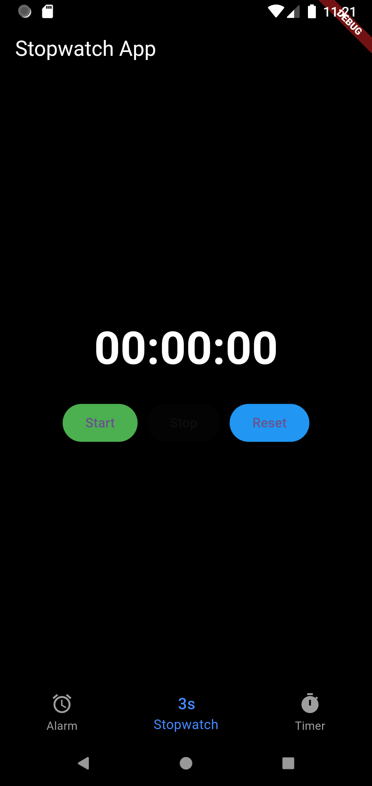
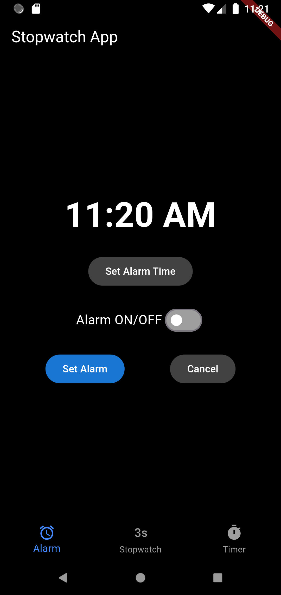
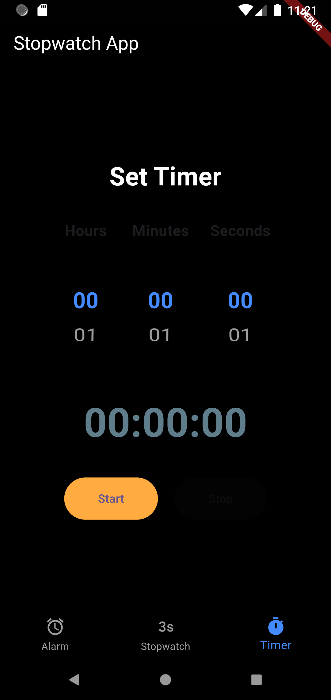

# ⏱️ Stopwatch & Alarm App

A sleek and user-friendly **Stopwatch & Alarm App** built with Flutter. This app lets you measure time accurately using a stopwatch and set alarms to stay on schedule. 🚀

## 📌 Features
✅ Stopwatch with start, stop, and reset functionality
✅ Timer countdown feature
✅ Set and manage alarms easily
✅ Beautiful dark-themed UI
✅ Smooth animations and transitions

## 📸 Screenshots
| Stopwatch Screen                       | Alarm Screen || Timer Screen |
|----------------------------------------|-------------|-------------|
|  |  | 

## 🚀 Installation
1. **Clone the Repository**
   ```bash
   git clone https://github.com/Sakshi-2508/Stopwatch-Alarm-Flutter-Android.git
   cd Stopwatch-Alarm-Flutter-Android
   ```
2. **Install Dependencies**
   ```bash
   flutter pub get
   ```
3. **Run the App**
   ```bash
   flutter run
   ```

## 🛠️ Technologies Used
- **Flutter** 🟦 (Dart)
- **Material Design** 🎨

## 💡 How It Works
- The **Stopwatch** screen allows users to track time in real-time.
- The **Timer** lets users set countdowns.
- The **Alarm** screen lets users set alarms using a time picker and toggle the alarm on/off.

## 🤝 Contribution
Feel free to contribute! Fork the repo, make changes, and submit a pull request. 😊

## 📜 License
This project is **open-source** and available under the [MIT License](LICENSE).

---
Made with ❤️ by **[Sakshi]**

